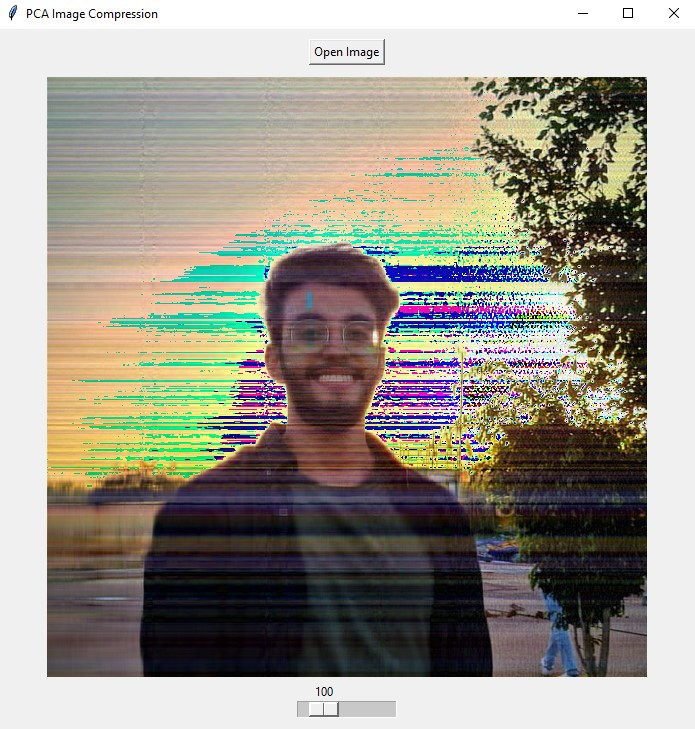
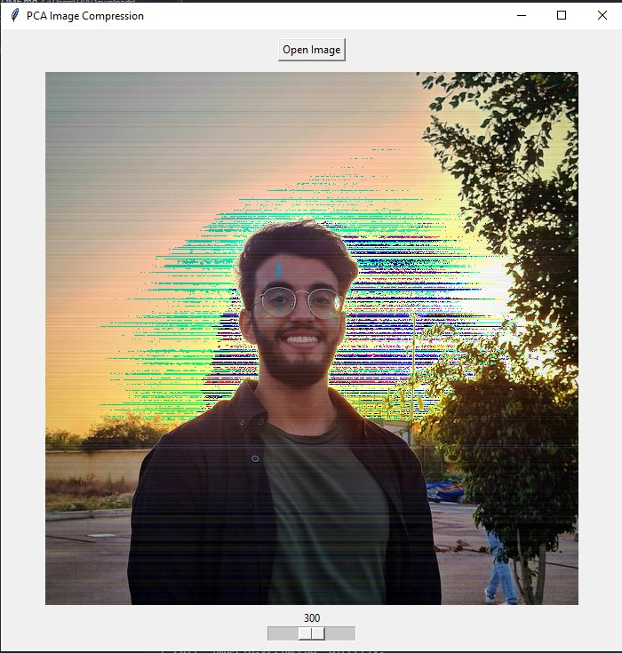
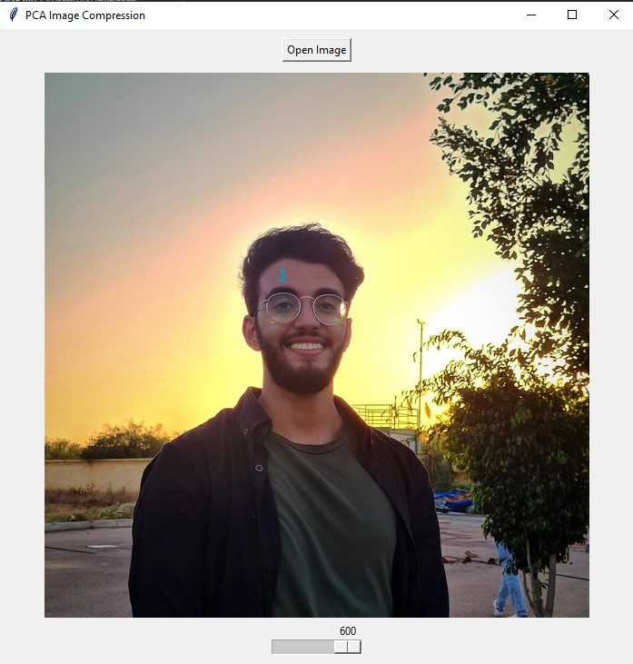

# Compression and Reconstruction of Color Image Using PCA

During my study of High-dimensional statistics, I opted to undertake some enjoyable projects in order to gain a deeper understanding of the concepts. One such project involved reconstructing a [600,600,3] RGB image using PCA, which is documented in this repository. To fully comprehend this undertaking, a solid grasp of eigendecomposition and covariance matrix may be necessary. Additionally, I have created another repository containing Python code that covers these concepts using Numpy. Please feel free to peruse it!

## The input image:

  

## 100 Principal Components:

  

## 300 Principal Components:

  

## 600 Principal Components:

  

# Conclusion:

By utilizing the first 100 principal components (PCs), a relatively high-quality image was reconstructed. It is worth noting that in our eigendecomposition step, we had 600 PCs since our input image had 600 columns. Therefore, PCA analysis can significantly reduce the image's dimensions. Moreover, you can adjust the mean normalization step to your liking; for instance, you can use 0.5 * np.mean(2D_image, axis=1) to reduce noise to some extent. I recommend giving it a try.
